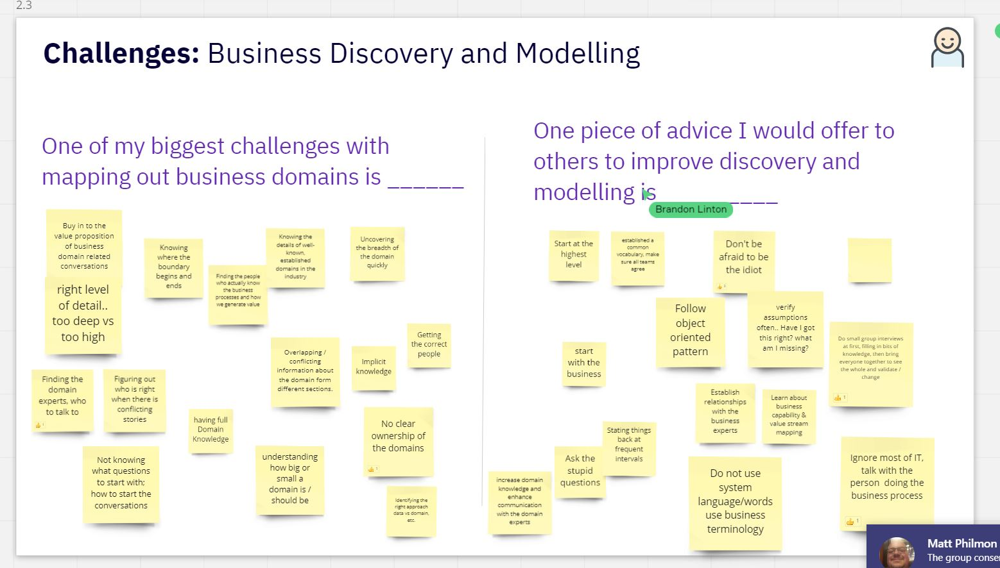

* Is the merger even legal.
* Is the a merger/acquisition.
* Might have overhead.
* If we can build templates that can help us.
* Is there any cross selling.

* what are the strategic goals for the domain?

* How the teams interact with each other influence the architecture.
* If teams align to the domain then teh teams start gathering specific domain.
* Start with Domain Boundaries.

Conway's law -->

***Organizations, who design systems, are constrained to produce designs which are copies of the communication structures of these organizations.***

*Align the team to the domain.*

#### Ways to find the domain boundaries

What is Event Storming ?

