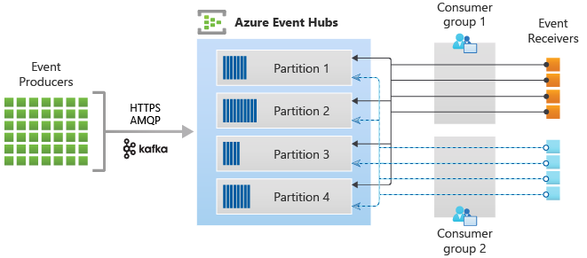

## What is event hubs?

Azure Event Hubs is a big data streaming platform and event ingestion service. It can receive and process millions of events per second.

Event Hubs represents the "front door" for an event pipeline, often called an event ingestor in solution architectures. An event ingestor is a component or service that sits between event publishers and event consumers to decouple the production of an event stream from the consumption of those events. Event Hubs provides a unified streaming platform with time retention buffer, decoupling event producers from event consumers.

## Key architecture components

Event Hubs contains the following key components:

* Event producers: 

Any entity that sends data to an event hub. Event publishers can publish events using HTTPS or AMQP 1.0 or Apache Kafka (1.0 and above).

* Partitions: 

Each consumer only reads a specific subset, or partition, of the message stream.

* Consumer groups: 

A view (state, position, or offset) of an entire event hub. Consumer groups enable consuming applications to each have a separate view of the event stream. They read the stream independently at their own pace and with their own offsets.

* Throughput units (standard tier) or processing units (premium tier) or capacity units (dedicated) : 

Pre-purchased units of capacity that control the throughput capacity of Event Hubs.

* Event receivers: 

Any entity that reads event data from an event hub. All Event Hubs consumers connect via the AMQP 1.0 session. The Event Hubs service delivers events through a session as they become available. All Kafka consumers connect via the Kafka protocol 1.0 and later.

## Terminology

* Namespace : The logical container for the event hubs or topics.
* Event Publishers : Any entity that sends data to an event hub is an event publisher (synonymously used with event producer). Event publishers can publish events using HTTPS or AMQP 1.0 or the Kafka protocol
* Publishing an event : 
    * You can publish an event via AMQP 1.0, the Kafka protocol, or HTTPS.
    * There is a REST API to publish events.
    * A single publication has a limit of 1 MB.
    * Event Hubs throughput is scaled by using partitions and throughput-unit allocations.
    * It's a best practice for publishers to remain unaware of the specific partitioning model chosen for an event hub and to only specify a partition key that is used to consistently assign related events to the same partition.
    * **Event Hubs ensures that all events sharing a partition key value are stored together and delivered in order of arrival**.
    * If partition keys are used with publisher policies, then the identity of the publisher and the value of the partition key must match. Otherwise, an error occurs.

* Event Retention : Published events are removed from an event hub based on a configurable, timed-based retention policy. 

    * The default value and shortest possible retention period is 1 day (24 hours).
    * For Event Hubs Standard, the maximum retention period is 7 days.
    * For Event Hubs Premium and Dedicated, the maximum retention period is 90 days.
    * If you change the retention period, it applies to all messages including messages that are already in the event hub.
    * You cannot explicitly delete events.
    * If you need to archive events beyond the allowed retention period, you can have them automatically stored in Azure Storage or Azure Data Lake by turning on the Event Hubs Capture feature.

Publisher policy ???

* Capture: 

Event Hubs Capture enables you to automatically capture the streaming data in Event Hubs and save it to your choice of either a Blob storage account, or an Azure Data Lake Storage account. You can enable capture from the Azure portal, and specify a minimum size and time window to perform the capture.

## Partitions

Event Hubs organizes sequences of events sent to an event hub into one or more partitions. As newer events arrive, they're added to the end of this sequence.

A partition can be thought of as a "commit log". 

Partitions hold event data that contains 

* body of the event, 
* a user-defined property bag describing the event, 
* metadata such as its offset in the partition
*  its number in the stream sequence
* and service-side timestamp at which it was accepted.

Advantages of using partitions: 

Event Hubs is designed to help with processing of large volumes of events, and partitioning helps with that in two ways:

* Even though Event Hubs is a PaaS service, there's a physical reality underneath, and maintaining a log that preserves the order of events requires that these events are being kept together in the underlying storage and its replicas and that results in a throughput ceiling for such a log. Partitioning allows for multiple parallel logs to be used for the same event hub and therefore multiplying the available raw IO throughput capacity.

* Your own applications must be able to keep up with processing the volume of events that are being sent into an event hub. It may be complex and requires substantial, scaled-out, parallel processing capacity. The capacity of a single process to handle events is limited, so you need several processes. Partitions are how your solution feeds those processes and yet ensures that each event has a clear processing owner.

Properties of partitions

* The number of partitions is specified at the time of creating an event hub. It must be between 1 and the maximum partition count allowed for each pricing tier.    

    * Basic and standard is 32 partition per event hub.
*  In general we recommend users to maintain a maximum throughput of 1 MB/s per partition and choose the partition count to match the maximum throughput you want to handle. For example, if your use case requires 20 MB/s, it is recommended to choose at least 20 partitions to achieve the optimal throughput.

* You can use a partition key to map incoming event data into specific partitions for the purpose of data organization. The partition key is a sender-supplied value passed into an event hub.
