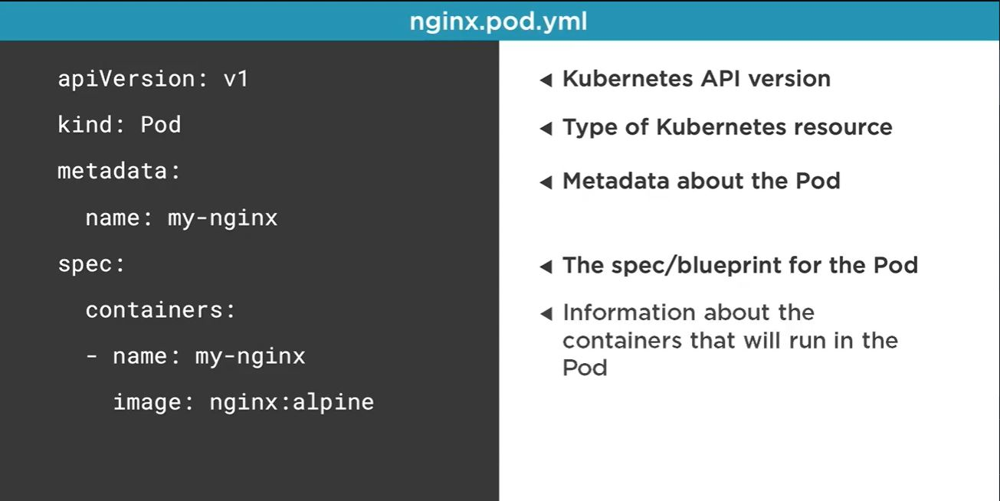

# Summary
1. [Install Kubernetes](#Install-Kubernetes)
2. [Pod](#Pod)


## Install Kubernetes

* Open an elevated command prompt
* Run the command 
```
choco install kubernetes-cli
```

* To start the dashboard 

https://www.replex.io/blog/how-to-install-access-and-add-heapster-metrics-to-the-kubernetes-dashboard

```
kubectl apply -f https://raw.githubusercontent.com/kubernetes/dashboard/v2.5.1/aio/deploy/recommended.yaml

kubectl proxy

```

* Set up login credentials

```
kubectl create serviceaccount dashboard-admin-sa

kubectl create clusterrolebinding dashboard-admin-sa --clusterrole=cluster-admin --serviceaccount=default:dashboard-admin-sa

kubectl get secrets

kubectl describe secret dashboard-admin-sa-token-<xxxx>

```

```
eyJhbGciOiJSUzI1NiIsImtpZCI6IkpVU2V4T3h3NTI2R2I1aDBCdW9NT3Y4LXkzUHplMXdHNGV1dzlGQ0s2bFUifQ.eyJpc3MiOiJrdWJlcm5ldGVzL3NlcnZpY2VhY2NvdW50Iiwia3ViZXJuZXRlcy5pby9zZXJ2aWNlYWNjb3VudC9uYW1lc3BhY2UiOiJkZWZhdWx0Iiwia3ViZXJuZXRlcy5pby9zZXJ2aWNlYWNjb3VudC9zZWNyZXQubmFtZSI6ImRhc2hib2FyZC1hZG1pbi1zYS10b2tlbi13cm1rcCIsImt1YmVybmV0ZXMuaW8vc2VydmljZWFjY291bnQvc2VydmljZS1hY2NvdW50Lm5hbWUiOiJkYXNoYm9hcmQtYWRtaW4tc2EiLCJrdWJlcm5ldGVzLmlvL3NlcnZpY2VhY2NvdW50L3NlcnZpY2UtYWNjb3VudC51aWQiOiIxNjZlZDBlMC03ZjVlLTRhOTAtYmNjOS1hYjM2MTQyZmQyZDMiLCJzdWIiOiJzeXN0ZW06c2VydmljZWFjY291bnQ6ZGVmYXVsdDpkYXNoYm9hcmQtYWRtaW4tc2EifQ.qMPE3mdmys-dbFFG3tOtlvTca8BsQMjzIH1KEHK-KGV0IfJ2oFt2EI2e2eF7N-GcsI9a-YdRfUhK7J3iZb9ClBjUhZZJ2oLUTu4bNteqt6bqyMb33t56prn3fbquGkfRJ9vAkZ-wqWu2jgXNlCU4v1QR0dR1bwNSV20a8sp8GpORWnao4kDfQFtyeavBA4N_V9NYs3CyXe-LeQ23oIa27sx3ZI05dpWlez4bkBA_i7EY-zdB0F3U9DyX7zor0ApDsNWObgcBze6js5VygF0uiOQASPprYRIulvyCW-ml3V2-9XboROCoAJvghqH_m1DUIxUuUgV1JWr_7oqXMISfOg
```

* To access the dashboard navigate to http://localhost:8001/api/v1/namespaces/kubernetes-dashboard/services/https:kubernetes-dashboard:/proxy/#/login

* Use the token extracted earlier to login.

* Command to show all pods

```
kubectl get pods
```
* sample command to get a pod running

``` 
kubectl run hello-nginx --image=nginx:alpine --port=8080
```

The pod is running but there is no service which is exposing this pod.

```
kubectl expose pod hello-nginx --type=LoadBalancer --port=8080 --target-port=80
```

## Pod

A Pod is the basic execution unit of a Kubernetes application- the smallest and simplest unit in the Kubernetes obejct model that you create or deploy.

* Pod containers will share the same Network namespace.
* Pod containers have the same loopback netwrok interface.


### kubectl basic

kubectl run [pod-name] --image=nginx:alpine

kubectl get pods

kubectl port-forward [pod-name] <external-port>:<container-port>

kubectl delete pod [pod-name]

### Yaml based deployment



```yml
apiVersion : v1
kind: pod
metadata :
  name: my-nginx
spec:
  containers:
  - name: my-nginx
    image: nginx:alpine
```
*This is the dry run option for validation*

kubectl create -f nginx.pod.yml --dry-run --validate=true

*The final action command*

kubectl create -f nginx.pod.yml

kubectl apply -f nginx.pod.yml

***If we use apply then it will create or update***

k exec my-nginx -it sh


## Pod Health

Kubernetes uses Probe to check the health of the Pod

There are two types of probes

1. Liveness probes
2. Readiness probes

we can do 

ExecAction
TCPSocketAction
Http probe


