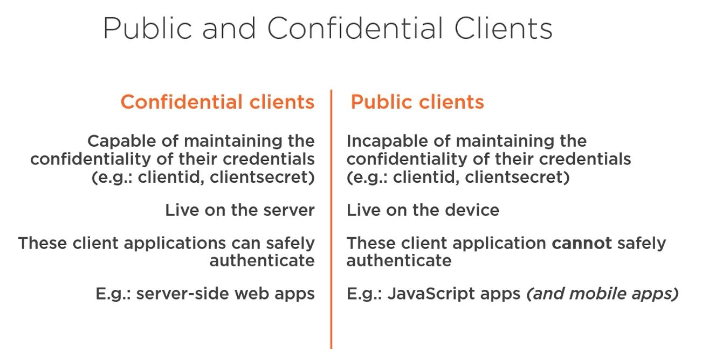
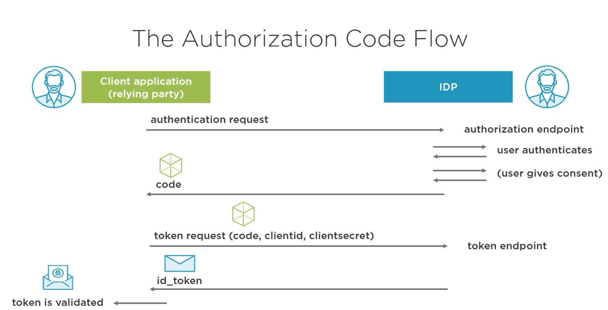

# OpenId

## Why we need OpenId

The current application landscape is heavily dominated by API based micro services. These APIs are not always internal or live in the same domain so the cookie based authentication is not useful. The other approach could be sending username password along with each call which is also not that secure.

## Token based security 

The basic idea of a token based security is that the client will send a token which indicates consent by the provider to allow the token creator access to the API as long as the request is coming with the token.

The next question was how these tokens will be generated. The most common option that came up was to write home grown token endpoints which the consumers will call and exchange their username and password for a token. This is an improvement but still has the following concerns

- We still have to share user name and password.
- When we create these endpoints we have to implement the following concepts on our own and maintain internally.
    - Token Expiration.
    - Token signing and validation.
    - We have to think about Token Format.
    - We need to determine how to handle Authentication and Authorization and how to separate them.
    - We have to find a way to securely. 

We have two issues to solve

- Define central location for token related task.
- Keep things safe enough to store them.

The IDP ( identity providers) are responsible for the following

- Centralizing the identity related task.
- Storing them in a secure way.
- Provide multiple ways of access for the users.

### Oauth 2 

It is an authorization protocol. In this protocol a token provider is used to provide the client application with an authorization token which can be used to access APIs and other resources.

### OpenId Connect

It is an extension to oauth where the client application gets an identity token next to an access token.

There will be an additional endpoint to get the user information. It is called the user info endpoint. This is the superior protocol which covers both ***Authentication*** and ***Authorization***.

#### How OIDC works

- There are 2 parties involved the Client Application also known as the relying party and the IDP or identity provider. 
- When the user wants to access the client application he/she is redirected to the IDP.
- The user identifies themselves to the IDP using various authentication mechanism. ( most common being the username and password).
- The IDP then creates an identity token signs it then returns to the client.
- Client application then validates the token and if the checks pass then the client application now has a validated identity.
- This identity token then used to create a claims identity. And is stored as a cookie in browser. And then is sent to the application.

There could be two types of clients 

        - Confidential Clients.
        - Public Clients.

These are the differences between them

 

There are different types of OIDC flows. These flows determine how the token is created and returned to the client. Which flow is used for OIDC depends on the type of client ( public / confidential).

These flows are orchestrated by the different endpoints. 

##### OpenId Endpoints

- ***Authorization Endpoint***

This is the endpoint is hosted by the IDP and used by the client application to obtain authentication ( in form of identity token) and authorization ( inform of access tokens ). TLS is mandatory for this traffic.

- ***CallBack Endpoint***

This is an endpoint hosted by teh client where the IDP returns the tokens.

- ***Token Endpoint***

This endpoint lives at the IDP level and can be used by the client s to get tokens without redirecting.

##### OpenId flows

 

* OpenId Connect Authorization Code flow

    - Authorization code is returned from the Authorization endpoint.
    - Tokens are returned from the token endpoint.
    - It is more suitable for the confidential clients.
    - Provides long lived access through the token refresh.

* OpenId Connect Implicit flow

    - The tokens are returned from the from authorization end point.
    - The token endpoint is not used.
    - Suitable for public clients.
    - No refresh token flow for long lived access.

* Hybrid Flow

    - Some tokens from Authorization end point.
    - Some tokens are returned from the token endpoint.
    - This is more suitable for confidential clients.
    - There can be long lived access.

Choosing the long flow will open us up to security vulnerability.

#### Authorization Code Flow

The authorization code flow has the following steps

- The client app redirects the user to a IDP uri. This is sample of it 

 

Following are the components of the URI

1. IDP URI for the Authorization endpoint.
2. client_id is the id for the client application.
3. redirect uri is the endpoint hosted by client where the IDP will send the authorization code.
4. scope provides the IDP with the information which details will sent back. In this case the openid and profile is requested which means that the user identifies and the profile related claims will be sent back.
5. response type value determines which flow will be used. For Authorization Code flow it is code. For implicit it is id_token token. For hybrid flow it is mixed up.

Steps in the flow

1. A web application creates a authentication request with response type ***code***.
2. Web app send the request to IDP or redirects.
3. The user authenticates with the IDP providing their username and password.It can optionally get consent for the scopes.
4. The IDP then redirects to the web app it includes the code. This code is delivered via URI which is a front channel communication.
5. This is the short lived identity for the client which logged in the IDP. 
6. The web client then calls the token end point from the back channel. For this call the client send the authentication code and the client credentials for the application.
7. The IDP provides sends back a identity token.
8. This token is then validated. If this checks out then the used identified is extracted.

 

